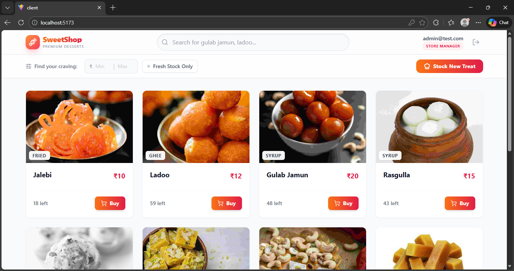
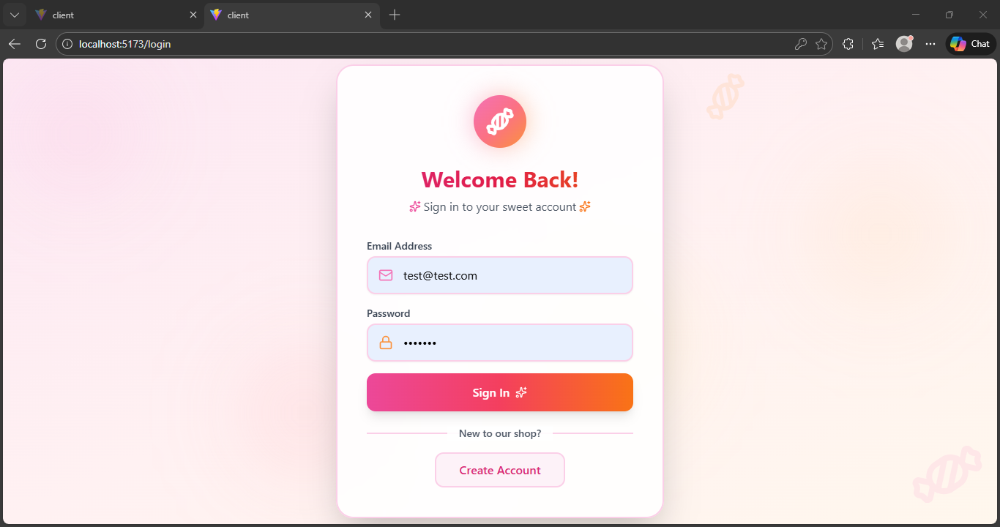
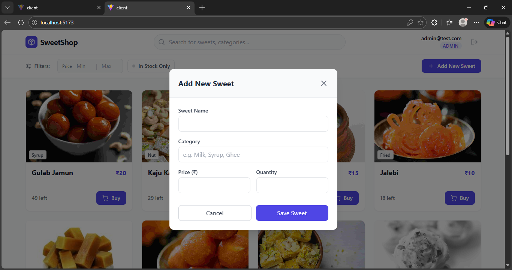
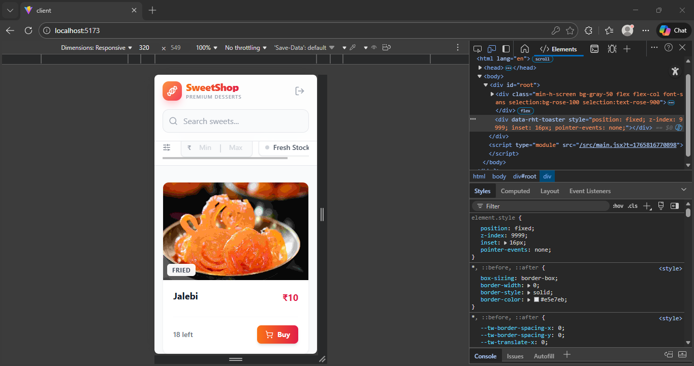

# 🍬 Sweet Shop Management System

[](https://github.com/someswar177/sweet-shop/actions)


> **🚀 Live Demo:** [https://sweet-shop.vercel.app](https://sweet-shop.vercel.app)
> *(Note: The backend is hosted on Render free tier. The first request may take 30-50s to wake up. Please be patient!)*

A full-stack **Software Craftsmanship assessment project**. This application manages a sweet shop inventory with secure authentication, atomic purchasing transactions, and a reactive UI. Built with a strong focus on **TDD (Test Driven Development)** and **Clean Architecture**.

---

## 🚀 Features

### 🔒 Security & Authentication
* **JWT Authentication:** Secure stateless session management.
* **RBAC (Role-Based Access Control):** Distinct `User` vs `Admin` capabilities.
* **BCrypt Hashing:** Passwords are never stored in plain text.
* **Security Hardening:** Implemented `Helmet` headers and `Zod` input validation.

### 🍬 Inventory Management (Admin)
* **Full CRUD:** Admins can Add, Edit, and Delete sweets via a modal interface.
* **Atomic Transactions:** Uses MongoDB `$inc` to prevent race conditions (overselling stock).
* **Smart Seeding:** Database pre-populated with verified image assets.

### 💻 Modern Frontend
* **Responsive Dashboard:** Built with React + Tailwind CSS (Mobile Optimized).
* **Advanced Filtering:** Filter by Price Range, Availability, and Name.
* **Optimistic UI:** Instant feedback on purchases before server confirmation.
* **Smart Image Fallbacks:** Gracefully handles missing images with default assets or emojis.

---

## 📸 Application Screenshots

### 🏪 The Shop Floor (Interactive Dashboard)
*Features the new "SweetShop" rose-gold branding, real-time inventory grid, and smart filtering.*


### 🎨 Design & Experience
| **Secure Entry (Auth)** | **Inventory Control** | **Mobile Responsive** |
|:---:|:---:|:---:|
|  |  |  |
| *Modern gradients & glassmorphism* | *Thematic "Recipe" management* | *Optimized for all devices* |

---

## 🛠️ Tech Stack

| Domain       | Technologies                                                         |
| ------------ | -------------------------------------------------------------------- |
| **Backend** | Node.js, Express.js, MongoDB (Mongoose), Zod, Helmet                 |
| **Frontend** | React (Vite), Tailwind CSS, Context API, Axios, Lucide React         |
| **Testing** | Jest, Supertest (Backend Integration), Vitest, React Testing Library |
| **DevOps** | GitHub Actions (CI Pipeline), Render (Backend), Vercel (Frontend)    |

---

## 🧪 Test Report
A comprehensive test report detailing all executed test cases is available here:
[📄 View Full Test Report](./TEST_REPORT.md)

---

## 🏃‍♂️ Getting Started

### Prerequisites
* Node.js **v18+**
* MongoDB (Local instance or MongoDB Atlas)

---

## 🔧 Backend Setup

1. **Navigate to the server directory**
   ```bash
   cd server
   ```

2. **Install dependencies**

   ```bash
   npm install
   ```

3. **Create a `.env` file inside the `server` folder**

   ```env
   PORT=5000
   MONGO_URI=mongodb://localhost:27017/sweetshop
   JWT_SECRET=your_super_secret_key_change_this
   ```

4. **Run the test suite (TDD verification)**

   ```bash
   npm test
   ```

5. **Seed the database (important for demo)**

   ```bash
   node src/seed.js
   ```

6. **Start the backend server**

   ```bash
   npm run dev
   ```

---

## 🎨 Frontend Setup

1. **Navigate to the client directory**

   ```bash
   cd client
   ```

2. **Install dependencies**

   ```bash
   npm install
   ```

3. **Start the development server**

   ```bash
   npm run dev
   ```

4. **Open the application**

   ```
   http://localhost:5173
   ```

---

## 🤖 AI Usage (Transparency Statement)

In alignment with the assessment guidelines, AI tools were used strictly as a **pair programmer** and **efficiency booster**. All architectural decisions, business logic, and TDD discipline were applied manually.

### Tools Used

* **Gemini (Google)**
* **Chatgpt**

### Detailed Usage Report

| Area                  | How AI Was Used                                                | Impact                                                 |
| --------------------- | -------------------------------------------------------------- | ------------------------------------------------------ |
| TDD Scaffolding       | Generated initial Jest + Supertest boilerplate for Auth module | Enabled faster red-state testing and requirement focus |
| Database Logic        | Verified MongoDB atomic operators (`$inc`, `findOneAndUpdate`) | Ensured thread-safe purchase logic                     |
| Testing Configuration | Generated GitHub Actions workflow with MongoDB service         | Enabled CI integration testing                         |
| Frontend Styling      | Suggested Tailwind utility classes                             | Faster UI iteration                                    |
| Data Seeding          | Generated sample Indian sweets dataset                         | Saved manual data entry time                           |

---

## 🧪 Test Report Summary

### Backend (Jest + Supertest)

* ✅ Auth: `POST /register`, `POST /login` (success & failure cases)
* ✅ Sweets: `GET /sweets`, `GET /sweets?search=...`
* ✅ Purchase: `POST /purchase` (atomic stock decrement, 400 on zero stock)
* ✅ Security: JWT validation and admin role checks

### Frontend (Vitest)

* ✅ Component rendering (`SweetCard` price & stock)
* ✅ Interaction: Buy button disabled when stock is `0`

---

## 📜 License

This project is open-source and available under the **MIT License**.

---